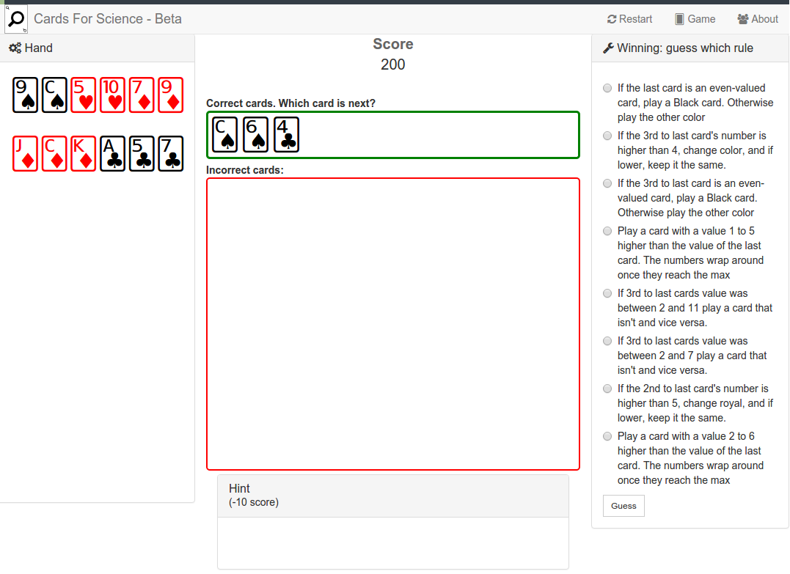

# Cards for science

Cards For Science is a card game where you work out the secret rule to determine which cards can be played. This game is based on Eleusis by Robert Abbott and John Golden's Eleusis Express.

</img>

## Install

`npm i`

## Serving

`npm start`

## Deploy

To run a producton bundle with webpack:

- `npm run dist`

Then to send to amazon s3 bucket:

- `gulp s3`

Note this depends on your amazon credentials and bucket being setup up in untracked file ./secrets/aws-credentials.json.
For more refer to the [docs](https://www.npmjs.com/package/gulp-awspublish).

I've been hosting it on an amazon bucket at cardsforscience.com.

## Testing

`npm test`

## Adding rules

Add rules to rules.js as a new rule object. Read the jsdoc comment for the rule object for params.

## Simulating

After adding a rule go to /src/js/rules/simulate.html and click "export table as JSON". Make this the contents of simulations.json. This tells the game which rule options are balanced.

## Developing

- `index.webpack` Html is from
- app.js is the main angular app
- game.js is the main game app, provided as a servie from angular 1
- cards.json are the cards and thier properties
- simulations - give balalance to the rules
- rules.js has the rules and thier classes
- ui.js is mostly left over
- helpers.js is mostly left over
- analytics is outdates and can be replaces with angulartics

## TODO

- [ ] acheivements
- [ ] analystics (I want to know how long they spend on each rule, and how many guesses)
- [ ] more rules, we have ~9 rules with ~300 variations
    - [ ] every black card must be follower by a card with a face
    - [ ] "Alternate between cards which have closed loops in their number or letter designations (e.g. 4, Q), and cards which don't (e.g. 2, K)".
    - [ ]  Play a sequence of suits from clubs to spades and back repeating the suit with clubs and spades, thusly, C, D, H, S, S, H, D, C, C, etc.
    - [ ] Play a progressive pattern of alternating red and black cards, such that first one black and one red card alternate, then two black and 2 red, then 3 black and 3 red, then repeat the pattern.
    - [ ] Cards are played consecutively upward or downward by 1, except skipping all the prime numbers (3,5,7,11,13). When 1 or 12 is reached the pattern reverses with the next card up or down. This Universe may start on any card except a prime number.
    - [ ] The sum of the card played plus the last card played must total a number that can be divided by 3 evenly. Thus totals of 3, 6, 9, 12, 15, 18, 21, & 24 are allowed. (For example, if the first card turned is an 8, correct cards are 1, 4, 7, 10, 13). The starting card may be anything but a 3, 6, 9, or 12, and that means these 4 values will never be played.
    - [ ] Each card played must be lower in value than the previous card, unless the card is 3 or less (3, 2, or 1), then the next card is that card's value plus 10 (3+10=13, 2+10=12, 1+10=11).
- [ ] prompts
    - [ ] when all cards are gone
    - [ ] when starting
    - [ ] when all hints are gone
